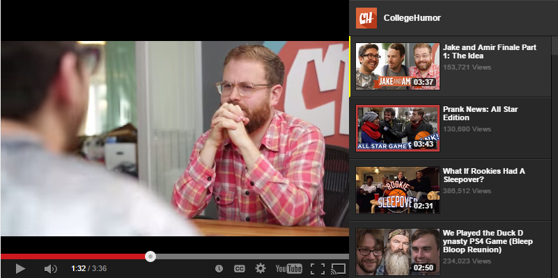
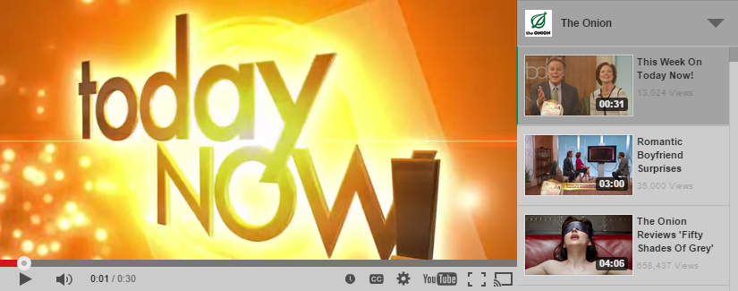
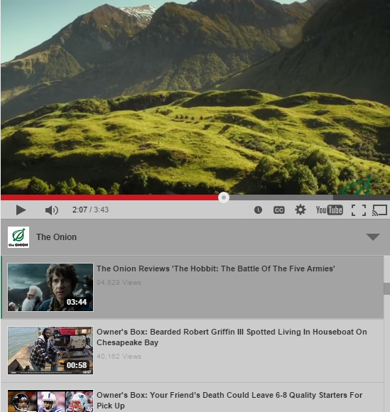
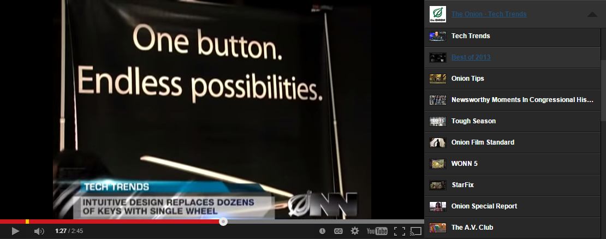

# YoutubeTV
A small, slick, library independent YouTube User/Playlist player



## Features
* Library Independent
* Customizable via CSS
* Autoplay
* Remove YouTube Chrome
* Supports Playlists and Users
* jQuery Support
* Module Support
* Responsive Support
* Alternative color scheme

## Demos
* [Default Player Options](http://giorgio003.github.io/Youtube-TV/demos/default.html)
* [Chromeless Player](http://giorgio003.github.io/Youtube-TV/demos/chromeless.html)
* [Playlist Support](http://giorgio003.github.io/Youtube-TV/demos/playlists.html)
* [Full Screen Player](http://giorgio003.github.io/Youtube-TV/demos/fullscreen.html) (Good for a .tv website?)
* [jQuery Support](http://giorgio003.github.io/Youtube-TV/demos/jquery.html)
* [Responsive Support](http://giorgio003.github.io/Youtube-TV/demos/responsive.html)
* [Multiple Players](http://giorgio003.github.io/Youtube-TV/demos/multiplayer.html)

## Obtaining Youtube API Key

As part of the update to [Youtube's API version 3](https://developers.google.com/youtube/v3/), it is required to obtain an API Key from [Google's Developer Console](https://console.developers.google.com/).

To obtain your API Key you can follow this guide using steps 1 to 3.
[https://developers.google.com/youtube/v3/getting-started](https://developers.google.com/youtube/v3/getting-started)

## Installation

After obtaining your API Key, fill it in `ytv.js` near the top via this line:
`var apiKey = 'YOUR_API_KEY_HERE';`

Include both the `ytv.css` and `ytv.js` in your HTML file and you are good to go.

```html
<link href="src/ytv.css" type="text/css" rel="stylesheet" />
<script src="src/ytv.js" type="text/javascript"></script>
```

## Usage

After your page has loaded, you may call the script like so:
```html
<div id="YourPlayerID"></div>
```
```javascript
document.addEventListener("DOMContentLoaded", function(event) {
    var controller = new YTV('YourPlayerID', {
	   user: 'YoutubeUsername'
    });
});
```
##### OR
```javascript
window.onload = function(){
    window.controller = new YTV('YourPlayerID', {
        user: 'YoutubeUsername'
    });
};
```


`YTV` accepts two parameters. The first is a string of the element ID you want to use as the player, OR it may the element itself. The second parameter is an object of options defined below:

## Settings and Defaults
```javascript
settings = {
    element: null,
    user: null,
    channelId: null,
    playlist: '',
    fullscreen: false,
    accent: '#fff',
    controls: true,
    annotations: false,
    autoplay: false,
    chainVideos: true,
    browsePlaylists: false,
    playerTheme: 'dark',
    listTheme: 'dark',
    responsive: false,
    wmode: 'opaque',
    events: {
        videoReady: function(){},
        stateChange: function(){}
    }
}
```

* `element`: The element or element ID to apply the YouTube TV Player to
* `user`: (String) The Username of the YouTube user you want to display videos from
* `channelId`: (String) The Channel ID of the YouTube channel you want to display videos from (for newer accounts)
* `playlist`: (String) The Playlist ID you would like to load (Overrides `user`)
* `browsePlaylists`: (Boolean) If `true` and the specified `user` has YouTube playlists, they will be accessible in the player by clicking the users Username
* `fullscreen`: (Boolean) If `true`, the player will take up all the available space on the users browser screen
* `accent`: (String) A CSS color string to apply to the accents of the player
* `controls`: (Boolean) If `false`, the normal YouTube controls will be hidden.
* `annotations`: (Boolean) If `false`, the annotations from the YouTube video will be hidden
* `autoplay`: (Boolean) If `true`, the first video in the list will automatically play once the player has loaded
* `chainVideos`: (Boolean) If `true`, the next video in que will automatically play after the current video has completed
* `playerTheme`: (String) Sets the youtube player theme. Default is `dark` with an alterative `light` color scheme.
* `listTheme`: (String) Sets the playlist theme. Default is `dark` with a `light` theme to match the alternative player theme.
* `responsive`: (Boolean) If `true`, it enables a responsive design to support various resolutions including mobile devices. Default currently `false`.
* `wmode`: (String) Sets the Window Mode property for transparency, layering, and positioning in the browser. Values can be: `window` - movie plays in its own rectangular window on a web page. `opaque` - the movie hides everything on the page behind it. `transparent` - the background of the HTML page shows through all transparent portions of the movie, this may slow animation performance.
* `events`: The respective events will fire when key actions in the player have been called


## Responsive Design
Youtube-TV can now adapt to various changes in resolution based on it's parent canvas/container. Currently set to `max-width:992px` to match Bootstrap's responsive transitions, but can be modified to match any other responsive boilerplate.

#### Playlist beside
*(image resized on github don't be fooled >_<)*

#### Playlist on bottom
*Better for mobile devices*


## Public Methods

### `destroy`
Destroys the YouTube TV Player and all associated elements/events

```javascript
controller.destroy();
```

### `fullscreen.state()`
Returns `true` if in Fullscreen Mode

```javascript
controller.fullscreen.state();
```

### `fullscreen.enter()`
Enters into Fullscreen Mode

```javascript
controller.fullscreen.enter();
```

### `fullscreen.exit()`
Exits Fullscreen Mode

```javascript
controller.fullscreen.exit();
```

## jQuery Support

YTV may be used as a jQuery plugin in the following fashion:

```javascript
$('#frame').ytv({opts});
```



## Licensing
**MIT Licensing**
<p>Copyright (c) 2013 Jacob Kelley</p>
<p>Permission is hereby granted, free of charge, to any person obtaining a copy of this software and associated documentation files (the "Software"), to deal in the Software without restriction, including without limitation the rights to use, copy, modify, merge, publish, distribute, sublicense, and/or sell copies of the Software, and to permit persons to whom the Software is furnished to do so, subject to the following conditions:</p>
<p>The above copyright notice and this permission notice shall be included in all copies or substantial portions of the Software.</p>
<p>THE SOFTWARE IS PROVIDED "AS IS", WITHOUT WARRANTY OF ANY KIND, EXPRESS OR IMPLIED, INCLUDING BUT NOT LIMITED TO THE WARRANTIES OF MERCHANTABILITY, FITNESS FOR A PARTICULAR PURPOSE AND NONINFRINGEMENT. IN NO EVENT SHALL THE AUTHORS OR COPYRIGHT HOLDERS BE LIABLE FOR ANY CLAIM, DAMAGES OR OTHER LIABILITY, WHETHER IN AN ACTION OF CONTRACT, TORT OR OTHERWISE, ARISING FROM, OUT OF OR IN CONNECTION WITH THE SOFTWARE OR THE USE OR OTHER DEALINGS IN THE SOFTWARE.</p>
